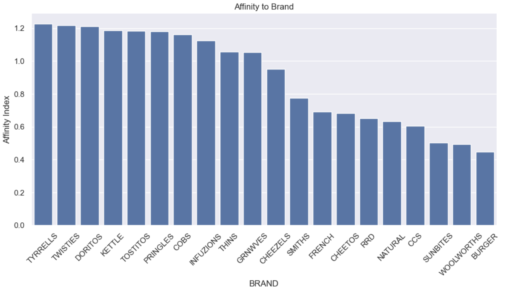

# Patrick's Portfolio
Welcome to my project portfolio!
Here is where I present the projects that I worked on and currently working on.

---

## Quantium Virtual Internship Tasks
This project is part of virtual internship program of [Quantium](https://quantium.com/) through [Forage](https://www.theforage.com/).

### [Retail Strategy and Analytics - Task 1](https://github.com/DonPatricious/Quantium_Chip_Analysis/tree/a8500d4d022bb780c4e0834dc04be068584ae559/Retail_Strategy_and_Analytics-Task_1)
The goal of the task is as follows:
- Analyze transaction and customer data to identify trends and inconsistencies.
- Develop metrics and examine sales drivers to gain insights into overall sales performance.
- Create visualizations and prepare findings to formulate a clear recommendation for the client's strategy.

[*Click to go to code repository*](https://github.com/DonPatricious/Quantium_Chip_Analysis/tree/a8500d4d022bb780c4e0834dc04be068584ae559/Retail_Strategy_and_Analytics-Task_1)

#### Total Sales per Customer Lifestage

#### Customer Brand Preference

### [Retail Strategy and Analytics - Task 2]()

