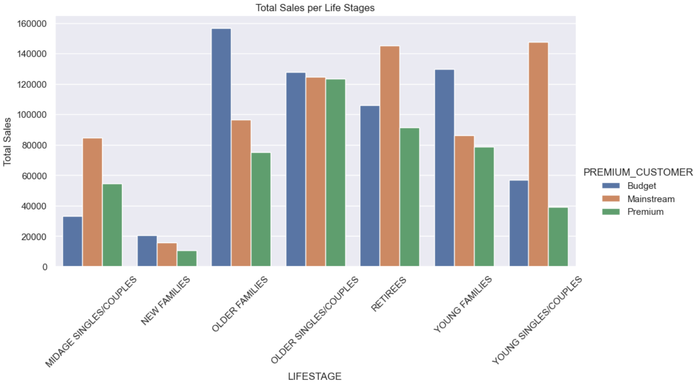

# Patrick's Portfolio
Welcome to my project portfolio!
Here is where I present the projects that I worked on and currently working on.

---

## Retail Strategy and Analytics - Task 1
This project is part of virtual internship program of [Quantium](https://quantium.com/) through [Forage](https://www.theforage.com/). The goal of the task is as follows:
- Analyze transaction and customer data to identify trends and inconsistencies.
- Develop metrics and examine sales drivers to gain insights into overall sales performance.
- Create visualizations and prepare findings to formulate a clear recommendation for the client's strategy.

